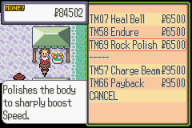
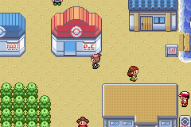
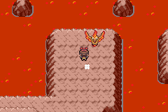
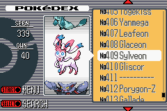
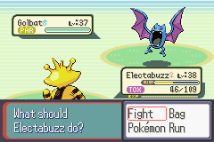
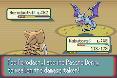
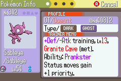
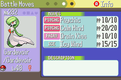
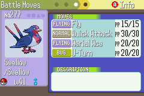

# Pokémon Good Ruby

This is an overhaul mod of Pokémon Ruby, built from pret's disassembly of the original game.

Features:

* 416 Pokemon are obtainable, consisting of the first 386 and all their evolutionary relatives.
* Battle system updated to Gen 7 mechanics, including physical/special split, modern moves, and modern abilities.
* A handful of new areas to explore, housing some rare mons.
* Enemy trainers no longer use items in battle, but have more difficult teams.
* Hidden Abilities, 92 TMs, and an Egg Move Tutor to help you customize your mons to your liking.
* Adjustments to the stats and movepools of various Pokemon to improve balance and diversity.
* Countless smaller tweaks that would make this list far too long.

Downloads can be found in the [Releases tab](https://github.com/Doesnty/goodruby/releases). The current version is v1.0 beta.

Known issues:
 * Contests aren't finished. You can run them, but they'll be boring vanilla opponents, and the Berry Blender is only partly overhauled.
 * Post-game is under construction. Kyogre, Deoxys and one of Latias or Latios are unobtainable.
 * Attacks don't automatically re-target in Doubles. It's possible other weirdness happens there as well; the hack's focus is on Singles.

I also advise looking through [monchanges.txt](https://github.com/Doesnty/goodruby/blob/master/notes/monchanges.txt), which documents significant type and move changes.

Screenshots:

