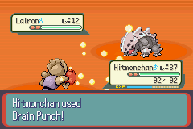
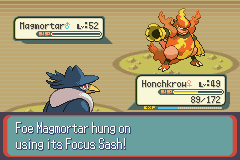

# Pokémon Good Ruby

This is an overhaul mod of Pokémon Ruby, built from pret's disassembly of the original game.

Features:

* First 386 Pokemon are all obtainable, as well as their evolutionary relatives in future gens.
* Battle system updated to Gen 7 mechanics, including physical/special split, modern moves, and modern abilities.
* A handful of new areas to explore, housing some rare mons.
* Enemy trainers no longer use items in battle, but have more difficult teams.
* Hidden Abilities, 92 TMs, and an Egg Move Tutor to help you customize your mons to your liking.
* Adjustments to the stats and movepools of various Pokemon to improve balance and diversity.
* A bunch of smaller tweaks that would make this list far too long.

Screenshots:

